# How to securely wipe your laptop and/or mobile phones

## What type of device would you like to wipe?
1. [Wipe Windows Laptop (Purchasing)](#wipe-windows-laptop)
1. [Wipe Windows Laptop (Returning)](#wipe-windows-laptop)
2. [Wipe Mac Laptop](#wipe-mac-laptop)
3. [Wipe iOS Phone](#wipe-ios-phone)
4. [Wipe Android Phone](#wipe-android-phone)
5. [Extra Information](#extra-information)

## Wipe Windows Laptop (Purchasing)

Follow these instructions if *you want to purchase your machine*.

1. Open `Settings > Update & Security > Recovery`
1. Click `Get Started` button under `Reset this PC`

    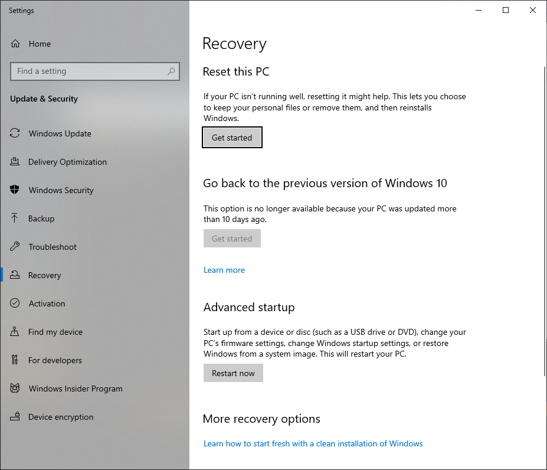

1. Click `Remove everything`

    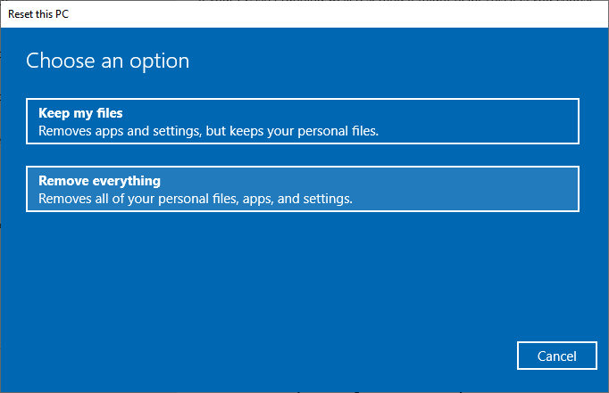

1. Click `Next`

    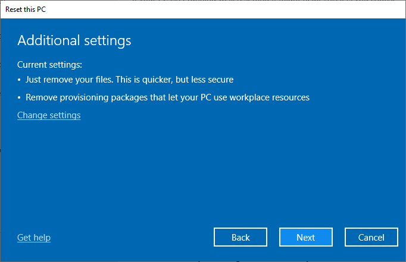

1. Click `Reset`

    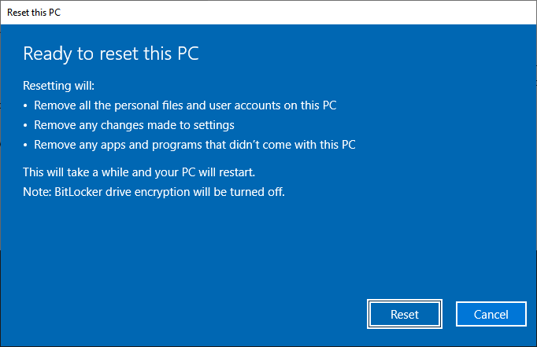

1. This will take a while and reboot multiple times. Leave it alone for a while.

## Wipe Windows Laptop (Returning)

Follow these instructions if *you don't want to purchase your machine*.

1. Log out of any accounts you are using on your computer.
   * Ex. Office365, Slack, Zoom, etc..
2. Get a USB drive you can erase.  Any size will do.  The boot image is only 16 megabytes.
3. Download and install [balendaEtcher](https://www.balena.io/etcher)
4. Download [DBAN](http://sourceforge.net/projects/dban/files/dban/dban-2.3.0/dban-2.3.0_i586.iso/download) boot image
6. Burn `dban-2.3.0_i586.iso` using `balenaEtcher`

    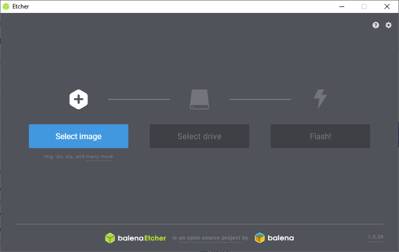
7. Boot to `DBAN` usb stick
    * Search for how to boot a USB stick online. Ex. Enter the search: `dell boot to usb stick`
    * Common laptops
      * [Lenovo](https://support.lenovo.com/us/en/solutions/ht500207)
      * [Dell](https://www.windowspasswordsreset.com/blog/boot-menu-key-and-bios-key-for-dell-laptop-and-desktop/)
      * [Microsoft Surface](https://support.microsoft.com/en-us/help/4023511/surface-boot-surface-from-a-usb-device)
7. Afer you boot `DBAN`, your screen should look like this. Press `ENTER` to go to the main menu screen.

   
8. Use the `Arrow Keys` and  `SPACE` to select the hard drive you want to wipe. It should say `[wipe]`.
   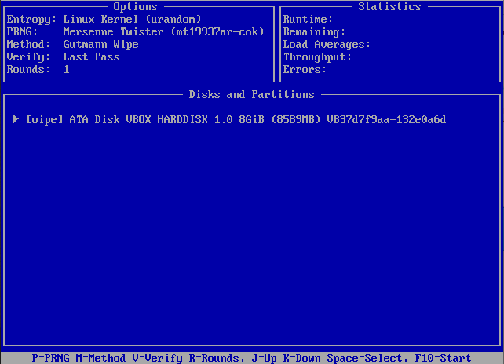
9. Press `M` to select the `Wipe Method`.  We recommend `Gutmann Wipe` but if that it too
   slow, you can use `DoD 5220.220-M`. Press `SPACE` to select and go back to the main menu.
   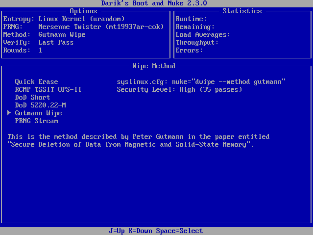
10. Review the config and press `F10` to start the wipe.
    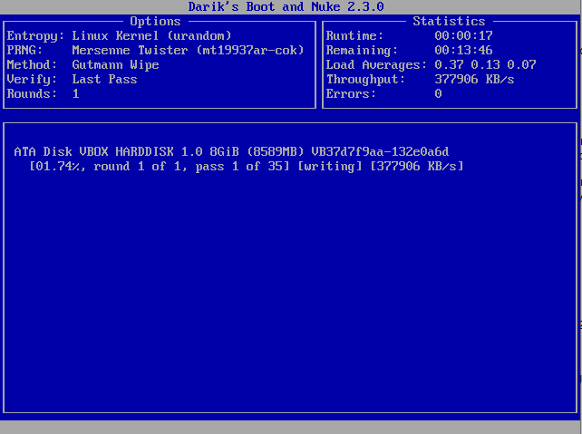
11. Leave the laptop alone for a while. It will take a lot of time.

## Wipe Mac Laptop

1. Remove all of `Internet Accounts` in `Settings`
   * Open `Settings > Internet Accounts`
   * Select each account and click `-` button at the bottom left
1. Sign out of iTunes
   * Open iTunes
   * From the menu bar at the top of your computer screen or at the top of the iTunes window, choose `Account > Authorizations > Deauthorize This Computer`.
   * When prompted, enter your Apple ID and password. Then click `Deauthorize`.
     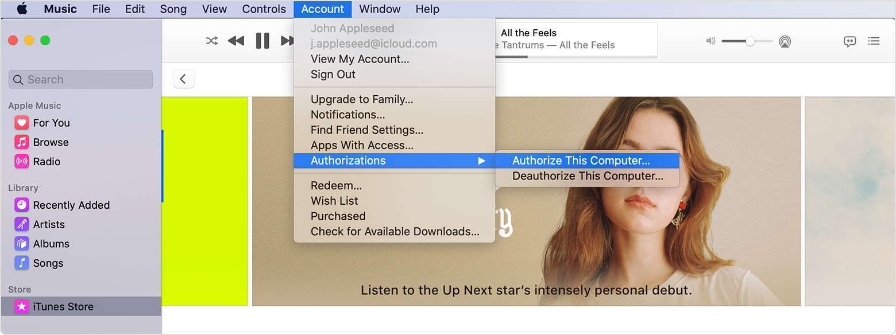
1. Sign out of iCloud
   * Choose Apple menu ` > System Preferences`, then click `Apple ID`.
   * Choose `iCloud` in the side panel and `Turn off Find My Mac`.
     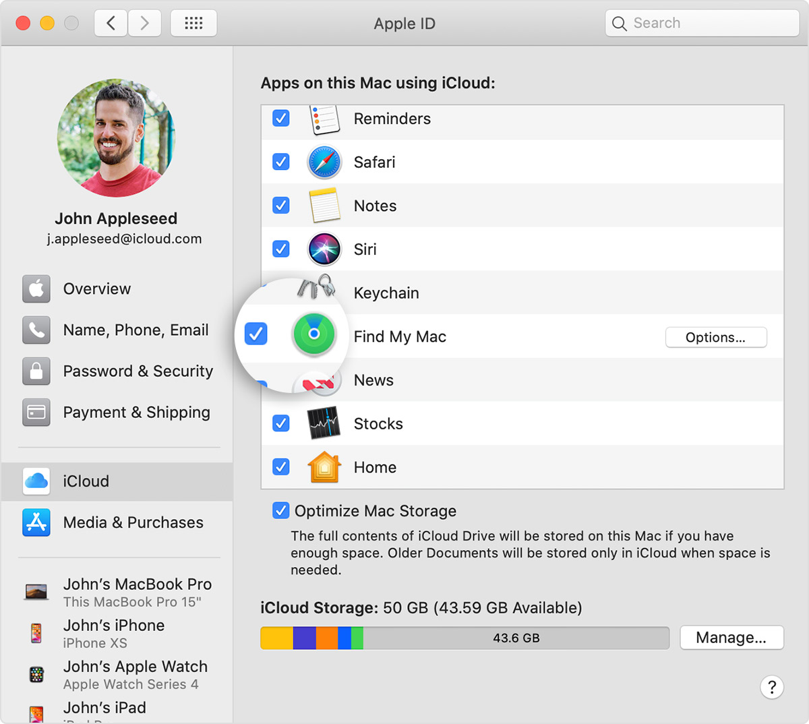
   * Then select `Overview` in the side panel and click `Sign Out`.
     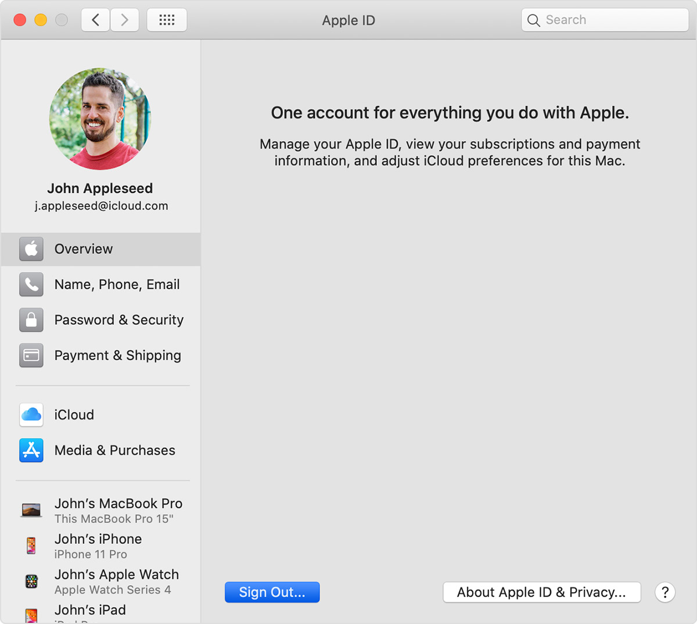
1. Sign out of `iMessage`
   * In the `Messages` app, choose `Messages > Preferences`, click `iMessage`, then click `Sign Out`.
1. Restart your mac ` > Restart...`.  Press `Command (⌘)-R` during the boot to enter recovery mode and login.
   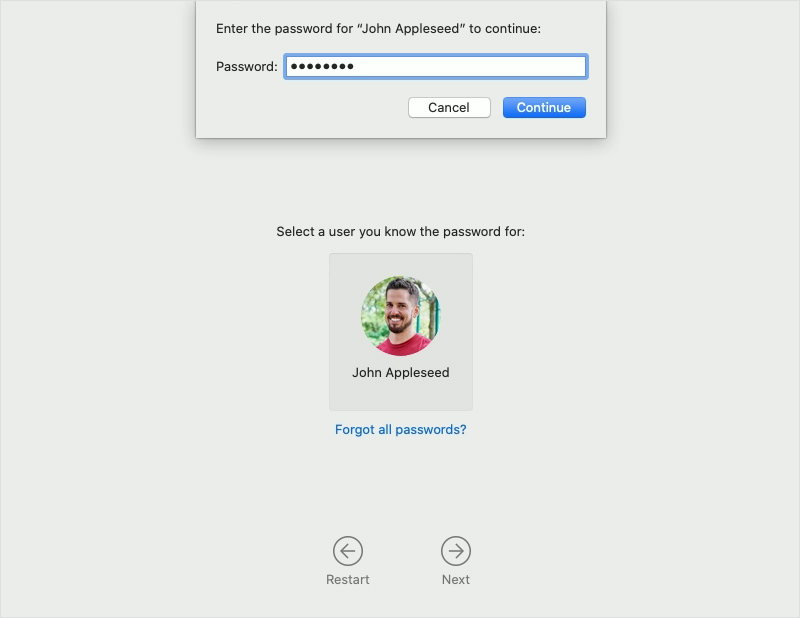
1. Start `DiskUtility`.

   
1. Choose `View > Show All Devices` from the menu bar in `Disk Utility`. The sidebar now shows your disks (devices) and any containers and volumes within them. The disk your Mac started up from is at the top of the list. Click the `Erase` button at the top center of the window.

   
1. Click `Security Options` and select the `Most Secure`. Click `Ok`. Click `Erase` to start the format.

   

1. Reinstall [MacOS](https://support.apple.com/en-us/HT201314) (Optional)

## Wipe iOS Phone

iOS as `Factory Reset Protection` which will not allow your phone to be used by others if you have an account logged in while you reset.  You will need to log out of your accounts before resetting.

1. Make sure the phone is plugged in and charged to at least `50%`.
1. Deregister your iMessage
   * `Settings > Messages` and tap `Sign Out`.
1. Sign out of iTunes, iCloud, & AppStore
   * *iOS 10.3*: Tap `Settings > [your name]`. Scroll down and tap `Sign Out`. Enter your Apple ID password and tap `Turn Off`.
   * *iOS 10.2*: Tap `Settings > iCloud > Sign Out`. Tap `Sign Out` again, then tap `Delete from My iPhone` and enter your Apple ID password.
     Then go to `Settings > iTunes & App Store > Apple ID > Sign Out`.
1. Erase the iPhone
   * Tap `General > Reset > Erase All Content and Settings`. If you turned on `Find My iPhone`, you might need to enter your Apple ID and password.

## Wipe Android Phone

Android as `Factory Reset Protection` which will not allow your phone to be used by others if you have an account logged in while you reset.  You will need to log out of your accounts before resetting.

1. Make sure the phone is plugged in and charged to at least `50%`.
1. Remove all your `Accounts` on the phone.
   * Tap `Settings > Accounts`
   * Select each individual account and tap `Remove Account`
   * Make sure the `Accounts` list is empty
1. Reset your phone
   * Tap `Settings > System > Reset options > Erase all data (factory reset)`
   * Confirm by tapping `Erase all data`
   * Wait until complete

## Extra Information

* [How to erase your iPhone, iPad, or iPod touch](https://support.apple.com/en-us/HT201274).
* [What to do before you sell, give away, or trade in your Mac](https://support.apple.com/en-us/HT201065).
* [What to do before you sell, give away, or trade in your iPhone, iPad, or iPod touch](https://support.apple.com/en-us/HT201351)
* [Deregister iMessage on your iPhone](https://support.apple.com/en-us/HT203042)
* [Reset your Android device to factory settings](https://support.google.com/android/answer/6088915?hl=en)
* [How to Securely Wipe a Hard Drive on Your Mac](https://www.howtogeek.com/179284/how-to-securely-wipe-a-hard-drive-on-your-mac/)
* [ How to Erase a Hard Drive Using DBAN](https://www.lifewire.com/how-to-erase-a-hard-drive-using-dban-2619148)